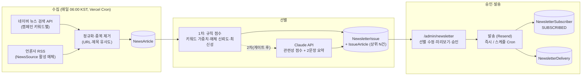

# AX 뉴스레터 발송 시스템(뉴스 큐레이션 파이프라인) 기본설계

> 작성일: 2026-09-28
> 상태: ✅ 1단계 구현 완료(2026-10-04) — 2단계(Claude 점수·스케줄 자동발송)는 1호 발송 2회 안정 후
> 벤치마크: 포스코 「뉴스배포관리시스템 사용자 매뉴얼」(DX전략실 DX기획그룹, 2026-07) — 화면 5종(새뉴스레터 만들기·기준관리·권한관리·자료수집관리·선별자료관리) + 매체 리스트 30곳
> 선행 문서: `2026-08-08-newsletter-design.md`(구독자 수집, 발송 파이프라인은 범위 제외로 남겨둠), `2026-08-22-sales-funnel-ax-check-design.md`(3단계 "팔로업 뉴스레터"), `2026-09-02-ax-check-auto-followup-design.md`(T2·뉴스레터는 `marketingOptIn=true`만 대상)
> 관련 규칙: `docs/PRD.md`, `CLAUDE.md`, 프로젝트 지침 5-1~5-4 (문서 우선, `prisma migrate dev` 금지, rate limiting·`url-safety.ts` 패턴 재사용, CSP nonce·Sentry 예외 없음)

---

## 1. 목표와 배경

### 1-1. 무엇을 만드는가

포스코의 뉴스배포관리시스템은 "**키워드로 언론 기사를 매일 수집 → 사내 LLM(P-GPT)이 관련성 점수를 매겨 선별 → 담당자가 확인·수정 → 지정 시각에 수신자에게 메일 발송**"하는 사내 뉴스 클리핑 시스템이다. 이 구조를 그대로 가져오되, 코어디엑스아이 홈페이지의 목적에 맞게 **외부 구독자(리드)에게 보내는 "AX 뉴스 큐레이션 뉴스레터"** 로 재해석한다.

```
[포스코]  뉴스수집 API ─▶ P-GPT 지표분석 ─▶ 담당자 선별 ─▶ 사내 수신자 메일
[CoreDXI] 네이버 뉴스 API + RSS ─▶ 규칙 점수(1차) / Claude API 점수(2차) ─▶ 관리자 승인 ─▶ 구독자(NewsletterSubscriber) 메일
```

### 1-2. 왜 지금 이 설계인가

- 구독자 수집(`NewsletterSubscriber`, Footer 폼, `/unsubscribe/[token]`, `/admin/newsletter`)은 2026-08-08에 완료됐고, **실제 발송 파이프라인만 비어 있다**(당시 "별도 트랙으로 재검토" 결정 → 이 문서가 그 재검토 결과).
- Phase 1.5 3단계(09/29~10/31)에 "팔로업 뉴스레터 1호 발송(옵트인 대상만, 시스템 자동 + 사용자 승인)"이 잡혀 있다. 매번 손으로 글을 쓰는 방식은 1인 법인에서 지속 불가능하므로, **기사 수집·선별을 자동화하고 사람은 승인만** 하는 구조가 필요하다.
- 2026-09-06 결정 "뉴스레터·콘텐츠 발송 담당 = 사용자 본인 + AI 비서(시스템 자동 발송 + 사용자 승인)"과 정확히 같은 모양이다.

### 1-3. 범위 밖 (이번 설계에서 다루지 않음)

- 사내·영업이사용 내부 클리핑 수신자 그룹 (→ 4단계 옵션으로만 언급, 데이터 모델은 확장 가능하게 둠)
- 언론사 사이트 직접 크롤링·기사 본문 전문 저장 (저작권·robots.txt 리스크 — 제목·링크·짧은 자체 요약만 취급)
- 열람/클릭 트래킹 대시보드 (2차 이후)
- 블로그 신규 글 자동 알림 (별개 기능, 본 뉴스레터에 "이번 주 코어디엑스아이 글" 섹션으로 수동 삽입만 지원)

---

## 2. 결정 사항 (2026-09-28 사용자 확정 3건 + 실용 기본값)

| # | 질문 | 결정 | 근거 |
|---|------|------|------|
| 1 | 목적·수신 대상 | **외부 구독자용 AX 뉴스 큐레이션** — `NewsletterSubscriber.status=SUBSCRIBED` 전원(AX 체크 `marketingOptIn` 합류자 포함) | 기존 구독자 DB·3단계 목표와 바로 연결. 사내 클리핑은 수신자 그룹 확장으로 나중에 흡수 가능 |
| 2 | 기사 수집 방식 | **네이버 뉴스 검색 API(키워드) + 언론사 RSS(매체 상시)** | 무료(네이버 일 25,000회)·합법·구현 단순. 본문 전문은 받지 않고 제목·요약·링크·발행일만 |
| 3 | AI 선별 | **1차 규칙 기반 점수 → 2차 Claude API 점수·요약** | 게이트 충족 전 LLM 코드 착수 금지 결정과 정합. 지표(선별지표) 이름·가중치는 1차·2차가 공유해 UI를 바꾸지 않고 엔진만 교체 |
| 4 | 발송 유형 기본값 | **"검토 후 발송(수동)"** 을 기본, 스케줄 자동 발송은 2차에서 켬 | 사용자 승인이 들어가는 구조(09/06 결정). 포스코의 즉시/스케줄링/검토후발송 3유형은 그대로 지원 |
| 5 | 발송 주기 | **주 1회(화 08:00 KST)**, 수집은 매일 | 리드 팔로업 "월 1회" 결정보다 잦지만 뉴스 큐레이션 특성상 주간이 적정. 캠페인 설정값이라 언제든 조정 |
| 6 | 권한 | 별도 권한관리 화면 신설 안 함 — 기존 관리자 역할(`SUPER_ADMIN`/`EDITOR`) 재사용, 캠페인별 `ownerId`·`coManagerIds` 필드만 둠 | 포스코 "뉴스레터 권한관리"는 통합권한관리 연동 화면이라 1인 법인에 과함 |
| 7 | 발송 엔진 | 기존 `sendResendEmail`(Resend) 개별 발송 → 구독자 100명 초과 시 Resend Batch API로 전환 | Resend Broadcasts는 게이트 이후 검토 항목(E 2차)이라 배제 |
| 8 | 메일 제목 `(광고)` 표기 | **표기한다** — 제목 템플릿 기본값 `(광고) [AX 위클리] …`, 푸터에 수신거부 안내 병기 | CTA(`/ax-check`) 포함으로 영리 목적 광고성 정보에 해당. 옵트인 구독자라 열람률 영향 제한적 (2026-09-28 확정) |
| 9 | 1호 캠페인 | **"중소기업 AI 도입·AX 전환" 단일 캠페인** | 구독자 규모가 작을 때 운영 부담 최소화. 업종별 세그먼트는 3단계 (2026-09-28 확정) |
| 10 | 매체 시드 | **IT·경제지 중심 10~15곳으로 재구성**, RSS 확인된 매체만 `isActive` — 첨부 30곳 중에서는 전자신문·매일경제·서울경제·머니투데이·이데일리·파이낸셜뉴스·아시아경제·이투데이·한국경제(추가) 등 경제·IT지만 채택, 지디넷코리아·아이티조선·디지털데일리·블로터·바이라인네트워크 추가 후보 | 포스코 리스트는 철강·지역지 위주라 AX 관련도 낮음. 최종 목록은 0단계 RSS 조사 후 시드 CSV로 확정 (2026-09-28 확정) |
| 11 | 발송 요일·시각 | **매주 화 08:00 KST** (`sendDayOfWeek=2`, `sendHourKst=8`) | 월요일 오전 메일 폭주 회피 (2026-09-28 확정) |
| 12 | LLM 요약 노출 | **요약 노출(2문장)** — 2차 착수 전(1단계)에는 API 제공 snippet 1줄 또는 관리자 직접 입력 | 큐레이션 가치는 요약에서 나옴. 원문 문장 인용 금지 프롬프트 필수 (2026-09-28 확정) |

---

## 3. 포스코 화면 ↔ CoreDXI 기능 매핑

| 포스코 매뉴얼 | 핵심 기능 | CoreDXI 대응 | 단계 |
|---|---|---|---|
| 1. 시스템 신청 (통합권한관리·EP앱) | 권한 신청·앱 설치 | `/admin` 로그인 + 역할(`SUPER_ADMIN`/`EDITOR`) | 기존 |
| 2-1. 새뉴스레터 만들기 | 기준등록(명칭·메일제목·발송유형·발송시점·사용기간·수집기간·선별기사 갯수·메일양식) → 수신자등록 → 자료검색키워드(AND/OR/NOT·우선순위) → 선별규칙(지표·가중치) | `/admin/newsletter/campaigns/new` 4단계 폼 | 1차 |
| 2-2. 뉴스레터 기준관리 | 조회·수정·미사용처리·삭제(임시저장만) | `/admin/newsletter/campaigns` 목록 + 상세 | 1차 |
| 2-3. 뉴스레터 권한관리 | 공동관리자 부여/회수 | 캠페인 `coManagerIds` 편집(간이) | 2차 |
| 2-4. 자료 수집관리 | 수집 기사 목록·진행상태(진행중/수집완료/발송완료)·지표점수·사용여부 변경·기사 상세 팝업 | `/admin/newsletter/campaigns/[id]/articles` | 1차 |
| 2-5. 선별 자료관리 | 선별 여부 수정·메일 미리보기·검토요청·메일 발송 | `/admin/newsletter/campaigns/[id]/issues/[issueId]` (호 편집·미리보기·발송) | 1차 |
| 매체 리스트 30곳 | 수집 대상 매체 | `NewsSource` 시드 데이터(RSS URL 확인된 매체만 활성) | 1차 |

---

## 4. 시스템 구성



**실행 경로 요약**

1. `GET /api/cron/newsletter-collect` (매일 06:00 KST = `0 21 * * *` UTC) — 활성 캠페인마다 키워드 검색 + RSS 수집 → `NewsArticle` upsert → 규칙 점수 계산 → 해당 주기의 `NewsletterIssue`(DRAFT)에 상위 N건을 `IssueArticle`로 붙임.
2. 관리자가 `/admin/newsletter`에서 초안 확인 → 선별 체크 조정·순서 변경·한 줄 코멘트 → 미리보기 → **승인**(`APPROVED`) 또는 **즉시 발송**.
3. `GET /api/cron/newsletter-send` (매시 정각) — `APPROVED` 이면서 `scheduledAt <= now` 인 호를 발송, `NewsletterDelivery` 기록, 상태 `SENT`.
   *발송유형 "즉시발송"은 관리자 버튼에서 같은 `sendIssue()`를 직접 호출.*

두 Cron 라우트 모두 기존 `/api/cron/ax-check-followup/route.ts`와 동일하게 `CRON_SECRET` Bearer 검증, `maxDuration = 60`, 실패 시 `Sentry.captureMessage`.

---

## 5. 데이터 모델 (Prisma, 신규 6개 테이블)

모두 Prisma 관리 신규 테이블 — `contacts`/`contact_settings`와 충돌 없음. **수동 `migration.sql` + `prisma migrate deploy`** 만 사용(지침 5-2).

```prisma
// ---------- 뉴스레터 기준(캠페인) : 포스코 "기준등록" ----------
enum NewsletterSendType { IMMEDIATE  SCHEDULED  REVIEW_THEN_SEND }   // 즉시 / 스케줄링 / 검토후발송
enum NewsletterCadence  { DAILY  WEEKLY  BIWEEKLY  MONTHLY }

model NewsletterCampaign {
  id               String              @id @default(cuid())
  name             String                                   // 뉴스레터 명칭 (내부용)
  subjectTemplate  String                                   // 메일 제목 템플릿 예: "[AX 위클리] {{issueDate}} 중소기업 AI 도입 소식"
  sendType         NewsletterSendType  @default(REVIEW_THEN_SEND)
  cadence          NewsletterCadence   @default(WEEKLY)
  sendDayOfWeek    Int?                                     // 0=일 … 6=토 (WEEKLY/BIWEEKLY)
  sendHourKst      Int                 @default(8)          // 발송시간 (KST 시)
  activeFrom       DateTime                                 // 사용기간 start
  activeUntil      DateTime?                                // 사용기간 end (null = 무기한이지만 UI에서 기본 12/31 채움)
  collectDays      Int                 @default(7)          // 수집기간: 발송 시점 기준 최근 N일
  maxArticles      Int                 @default(7)          // 선별기사 갯수
  templateKey      String              @default("ax-weekly")// 메일양식
  audience         String              @default("subscribers") // 수신자: subscribers | internal(확장용)
  internalRecipients String[]          @default([])         // audience=internal 일 때 이메일 목록
  ownerId          String
  coManagerIds     String[]            @default([])
  isActive         Boolean             @default(true)       // 미사용처리
  createdAt        DateTime            @default(now())
  updatedAt        DateTime            @updatedAt

  keywords  NewsletterKeyword[]
  rules     NewsletterSelectionRule[]
  sources   NewsletterCampaignSource[]
  issues    NewsletterIssue[]
  @@index([isActive])
}

// ---------- 자료검색 키워드 : 포스코 "자료검색키워드(AND/OR/NOT, 우선순위)" ----------
enum KeywordOperator { OR  AND  NOT }

model NewsletterKeyword {
  id          String          @id @default(cuid())
  campaignId  String
  campaign    NewsletterCampaign @relation(fields: [campaignId], references: [id], onDelete: Cascade)
  group       Int                              // 같은 group 안은 OR, group 간은 AND  → "(AI 도입 OR AX) AND (중소기업 OR 제조)"
  operator    KeywordOperator @default(OR)     // NOT 은 group 무관 제외어
  term        String
  weight      Int             @default(1)      // 우선순위(1~5): 규칙 점수 가중치
  @@index([campaignId])
}

// ---------- 선별규칙(지표) : 포스코 "등록된 선별규칙 / 선별지표" ----------
model NewsletterSelectionRule {
  id          String   @id @default(cuid())
  campaignId  String
  campaign    NewsletterCampaign @relation(fields: [campaignId], references: [id], onDelete: Cascade)
  indicator   String            // relevance | timeliness | credibility | novelty | depth
  label       String            // 관련성 / 시의성 / 신뢰도 / 신규성 / 상세도
  description String            // LLM 프롬프트에 그대로 들어가는 정의문
  weight      Int      @default(1)
  isEnabled   Boolean  @default(true)
  @@unique([campaignId, indicator])
}

// ---------- 매체 : 포스코 "매체 리스트" ----------
model NewsSource {
  id          String   @id @default(cuid())
  name        String   @unique      // 경향신문, 전자신문 …
  category    String                // 전국종합일간 / 경제일간 / 전문일간 / 방송사 / 영자일간 …
  homepage    String
  rssUrl      String?               // null 이면 네이버 API 결과의 매체 식별용으로만 사용
  domain      String   @unique      // originallink 도메인 매칭 (mk.co.kr 등)
  trustWeight Int      @default(3)  // 1~5, 규칙 점수의 매체 신뢰도
  isActive    Boolean  @default(true)
  campaigns   NewsletterCampaignSource[]
  articles    NewsArticle[]
}

model NewsletterCampaignSource {   // 캠페인별 RSS 상시수집 매체 선택
  campaignId String
  sourceId   String
  campaign   NewsletterCampaign @relation(fields: [campaignId], references: [id], onDelete: Cascade)
  source     NewsSource         @relation(fields: [sourceId], references: [id])
  @@id([campaignId, sourceId])
}

// ---------- 수집 기사 : 포스코 "자료수집관리" ----------
enum ArticleOrigin { NAVER_API  RSS  MANUAL }

model NewsArticle {
  id            String        @id @default(cuid())
  urlNormalized String        @unique       // 쿼리스트링·utm 제거, http→https 통일 → 중복 제거 키
  originalUrl   String
  title         String
  snippet       String?                     // API/RSS 가 주는 짧은 설명(HTML 태그 제거). 본문 전문 저장 금지
  publishedAt   DateTime
  sourceId      String?
  source        NewsSource?   @relation(fields: [sourceId], references: [id])
  sourceName    String?                     // NewsSource 매칭 실패 시 도메인 그대로
  origin        ArticleOrigin
  collectedAt   DateTime      @default(now())
  titleHash     String                      // 제목 정규화 해시 — 동일 기사 다매체 전재 묶기
  issueArticles NewsletterIssueArticle[]
  @@index([publishedAt])
  @@index([titleHash])
}

// ---------- 호(발송 단위) + 선별 결과 : 포스코 "선별자료관리" ----------
enum IssueStatus { COLLECTING  DRAFT  REVIEW_REQUESTED  APPROVED  SENDING  SENT  FAILED  CANCELED }

model NewsletterIssue {
  id           String      @id @default(cuid())
  campaignId   String
  campaign     NewsletterCampaign @relation(fields: [campaignId], references: [id])
  issueNo      Int                         // 캠페인 내 회차
  issueDate    DateTime                    // 발행 기준일
  subject      String                      // 템플릿 치환 결과, 관리자 수정 가능
  intro        String?                     // 상단 인사말(선택, 관리자 입력 또는 2차 LLM 초안)
  status       IssueStatus @default(COLLECTING)
  scheduledAt  DateTime?                   // 발송 예정 시각(UTC)
  approvedById String?
  approvedAt   DateTime?
  sentAt       DateTime?
  recipientCount Int       @default(0)
  createdAt    DateTime    @default(now())
  updatedAt    DateTime    @updatedAt

  articles   NewsletterIssueArticle[]
  deliveries NewsletterDelivery[]
  @@unique([campaignId, issueNo])
  @@index([status, scheduledAt])
}

model NewsletterIssueArticle {
  id          String   @id @default(cuid())
  issueId     String
  articleId   String
  issue       NewsletterIssue @relation(fields: [issueId], references: [id], onDelete: Cascade)
  article     NewsArticle     @relation(fields: [articleId], references: [id])
  ruleScore   Int                        // 1차 규칙 점수 0~100
  llmScore    Int?                       // 2차 Claude 점수 0~100
  llmReason   String?                    // 선별 사유 1줄
  summary     String?                    // 발송용 2문장 요약(2차 LLM 또는 관리자 직접 입력)
  indicatorScores Json?                  // {relevance: 80, timeliness: 90, …}
  isSelected  Boolean  @default(false)   // 선별 여부(관리자 수정 가능)
  sortOrder   Int      @default(0)
  editorNote  String?                    // 관리자 한 줄 코멘트(메일에 노출)
  @@unique([issueId, articleId])
}

// ---------- 발송 이력 : 포스코 "뉴스레터 발송이력" ----------
enum DeliveryStatus { QUEUED  SENT  FAILED  SKIPPED }

model NewsletterDelivery {
  id             String         @id @default(cuid())
  issueId        String
  issue          NewsletterIssue @relation(fields: [issueId], references: [id], onDelete: Cascade)
  subscriberId   String?                    // NewsletterSubscriber.id (internal 수신자는 null)
  email          String
  status         DeliveryStatus @default(QUEUED)
  resendId       String?
  error          String?
  sentAt         DateTime?
  @@unique([issueId, email])
  @@index([issueId, status])
}
```

**기존 테이블 변경**: `NewsletterSubscriber`는 그대로 사용. 필요 시 `lastSentAt DateTime?` 1개 컬럼만 추가(재발송 방지·통계용).

---

## 6. 수집·선별 로직 상세

### 6-1. 수집 (`src/lib/newsletter/collect/`)

| 모듈 | 역할 | 비고 |
|---|---|---|
| `naver-news.ts` | `GET https://openapi.naver.com/v1/search/news.json?query=…&display=100&sort=date` (헤더 `X-Naver-Client-Id/Secret`, 환경변수 `NAVER_SEARCH_CLIENT_ID/SECRET` — 소셜 로그인용 `NAVER_CLIENT_ID`와 분리) | 캠페인 키워드 group별로 OR 묶음을 각각 질의(네이버는 불리언 연산 미지원 → 결과를 로컬에서 AND/NOT 필터). 응답의 `originallink`·`title`·`description`·`pubDate` 사용, `<b>` 태그 제거 |
| `rss.ts` | `rss-parser`로 활성 `NewsSource.rssUrl` 파싱 | 서버에서 외부 URL을 fetch 하므로 **`url-safety.ts`의 SSRF 가드(사설 IP·비 https 차단)를 관리자 등록 시점과 fetch 시점 모두 적용** |
| `normalize.ts` | URL 정규화(utm·fbclid 제거, 모바일 도메인 → PC), 제목 정규화(괄호·기호·공백·매체명 접미 제거) → `titleHash` | 중복 키 2종: `urlNormalized` 완전일치, `titleHash` 동일 시 발행일 빠른 것만 남기고 나머지는 "전재"로 묶어 제외 |
| `collect-campaign.ts` | 위 셋을 조합해 캠페인 1개 수집 → `NewsArticle` upsert → 규칙 점수 → 현재 주기 Issue(DRAFT)에 상위 `maxArticles × 2`건을 후보로 부착(관리자가 고를 여지) | 수집기간 `collectDays` 밖 기사는 버림 |

네이버 API 무료 한도 일 25,000회 — 캠페인 3개 × 키워드 group 3개 × 페이지 2 = 18회/일 수준이라 문제 없음.

### 6-2. 1차 규칙 점수 (`score-rules.ts`, 게이트 전에도 설계·유닛테스트 가능)

```
ruleScore = clamp(0..100,
    40 × 키워드 적중률  (제목 적중 ×2, 요약 적중 ×1, keyword.weight 반영)
  + 25 × 최신성        (수집기간 안에서 선형 감쇠: 오늘=1.0, collectDays 전=0.2)
  + 20 × 매체 신뢰도    (NewsSource.trustWeight / 5, 미등록 매체 0.4)
  + 15 × 고유성        (titleHash 중복 매체 수가 많을수록 "큰 뉴스"로 가산, 단 전재본 자체는 제외)
)
```

순수 함수로 작성해 `score-rules.test.ts`(Vitest)로 고정 — `funnel-calc.ts` 패턴과 동일.

### 6-3. 2차 Claude 점수·요약 (`score-llm.ts`, **게이트 충족 후 착수**)

- 입력: 제목·요약·매체·발행일 + 캠페인의 `NewsletterSelectionRule`(지표 정의문·가중치) + 캠페인 목적 문장("중소기업 대표에게 AI 도입·AX 전환 관점에서 유용한가")
- 출력(JSON 강제): `{ indicatorScores: {relevance, timeliness, credibility, novelty, depth}, score, reason, summary }` — `summary`는 **2문장 이내, 기사 문장 인용 금지(자체 표현)** 를 프롬프트에 명시(저작권).
- 호출 단위: 이슈당 후보 14건 → 1회 배치 프롬프트(약 3~4K 토큰). 주 1회 × 캠페인 3개면 월 비용은 수백 원 수준.
- 최종 점수 = `0.4 × ruleScore + 0.6 × llmScore`, LLM 실패 시 `ruleScore` 만으로 폴백(그레이스풀 디그레이드 — `resend.ts` 패턴).
- SDK: `@anthropic-ai/sdk` 신규 의존성 1개. 환경변수 `ANTHROPIC_API_KEY` 미설정 시 2차 단계 자체를 건너뜀.

### 6-4. 발송 (`send.ts`)

- 수신자: `NewsletterSubscriber.status=SUBSCRIBED` 전원 (`audience=internal` 캠페인은 `internalRecipients`)
- 메일 1통 = `NewsletterDelivery` 1행. 발송 전 `QUEUED` 로 전원 insert → 순차 `sendResendEmail` → 결과 갱신. 중간 실패해도 재실행 시 `QUEUED`/`FAILED` 만 재시도(멱등).
- 구독자 100명 초과 시 Resend Batch(`/emails/batch`, 100통/호출)로 전환 — `resend.ts`에 `sendResendBatch` 추가.
- 각 메일 하단: 기존 `/unsubscribe/{unsubscribeToken}` 링크 + 회사 정보(상호·주소·문의 메일) + `List-Unsubscribe` 헤더.

---

## 7. 관리자 UI (`/admin/newsletter` 확장)

기존 페이지(구독자 수·목록)를 탭 구조로 확장. shadcn/ui `Tabs`·`Table`·`Dialog`·`Sheet` 사용, 로열 블루 `#1E4E8C`·`rounded-xl`·WCAG AA 유지.

| 라우트 | 화면 | 포스코 대응 |
|---|---|---|
| `/admin/newsletter` | 탭: **구독자**(기존) · **캠페인** · **발송 대기/이력** | 메인 |
| `/admin/newsletter/campaigns/new` | 4단계 위저드 — ① 기준(명칭·제목 템플릿·발송유형·주기·요일/시각·사용기간·수집기간·기사 수·양식) ② 수신자(구독자 전원 / 내부 지정) ③ 검색 키워드(group 추가·OR/AND/NOT·가중치, 결과 미리보기 버튼 = 네이버 API 즉시 조회 10건) ④ 선별지표(기본 5개 지표 체크·가중치) → **임시저장 / 저장** | 새뉴스레터 만들기 |
| `/admin/newsletter/campaigns` | 목록(명칭·주기·다음 발송·상태·담당자) · 수정 · 미사용처리 · 삭제(임시저장만) | 기준관리 |
| `/admin/newsletter/campaigns/[id]/articles` | 수집 기사 테이블(상태·제목·매체·발행일·규칙점수·LLM점수·사용여부) + 기간 필터 + 기사 상세 Sheet(요약·지표별 점수·원문 링크) + "지금 수집" 버튼 | 자료수집관리 |
| `/admin/newsletter/campaigns/[id]/issues/[issueId]` | 선별 편집 — 후보 체크·드래그 정렬·한 줄 코멘트·제목/인사말 수정 → **미리보기(실제 HTML 렌더)** → 검토요청 메일(내게 보내기) / 승인·예약 / 즉시 발송 / 취소 | 선별자료관리 |
| `/admin/newsletter/history` | 호별 발송 결과(수신 수·성공·실패·재시도 버튼) | 발송이력 |

발송유형별 동작 (포스코 표 그대로):

| 발송유형 | 횟수 | 자료수집 | 발송일 |
|---|---|---|---|
| 즉시발송 | 1회 | 저장 즉시 수집 | 관리자가 "즉시 발송" 누른 시점 |
| 스케줄링 | 반복 | 매일 Cron | 사용기간 내 지정 요일·시각에 **자동** 발송 (승인 없이 — 2차에서 활성화) |
| 검토후발송(수동) | 반복 | 매일 Cron | 초안이 쌓이면 관리자가 승인한 시점 또는 승인 시 지정한 예약 시각 |

**초안 알림**: 검토후발송 캠페인은 발송 예정일 전날 09:00 KST에 관리자에게 "초안 검토 요청" 메일(`SALES_NOTIFY_CC_EMAIL` 재사용, 링크 = 이슈 편집 화면). 이것이 포스코 "검토요청" 단계의 대체물이다.

---

## 8. 메일 양식 (`templateKey = "ax-weekly"`)

`src/lib/newsletter/templates/ax-weekly.tsx` — 기존 T0/T1 메일(`email-draft.ts`)처럼 서버에서 HTML 문자열 생성(외부 템플릿 엔진 추가 없음).

```
┌ 헤더: CoreDXI 로고 · "AX 위클리 #12 · 2026-10-06"
├ 인사말(intro, 2~3줄, 선택)
├ 기사 카드 × N
│   [매체명 · 발행일]  기사 제목(원문 링크)
│   2문장 요약(summary) — 없으면 snippet 1줄
│   ▸ 편집자 코멘트(editorNote, 선택)
├ (선택) "이번 주 코어디엑스아이 글" — 블로그 최신 글 1건 수동 선택
├ CTA 1개: "우리 회사 AX 우선과제 3분 진단 → /ax-check?ref=newsletter"
└ 푸터: 회사 정보 · 수신거부 링크 · "이 메일은 coredxi.com 뉴스레터 구독 신청에 따라 발송됩니다"
```

GA4: 링크에 `utm_source=newsletter&utm_medium=email&utm_campaign={campaign}&utm_content={issueNo}` 부착 → 기존 `cta_click`·`ax_check_submit` 이벤트에서 `source` 디멘션으로 성과 확인(신규 이벤트 없음).

---

## 9. 보안·정책 (지침 5-4)

- **Cron 보호**: `CRON_SECRET` Bearer, 실패 시 401 + 로직 미호출 (기존 라우트와 동일).
- **SSRF**: RSS URL·매체 홈페이지는 관리자 입력값이라도 `url-safety.ts`(https 강제·사설 IP·localhost 차단·리다이렉트 제한)를 등록 시·fetch 시 모두 통과해야 함. 네이버 API 호스트는 상수로 고정.
- **관리자 액션 게이트**: 모든 Server Action은 `requireAdmin()`(캠페인 편집·발송은 `SUPER_ADMIN` 또는 owner/coManager). rate limiting은 공개 폼이 아니므로 불필요, 단 "즉시 발송" 버튼은 동일 이슈 5분 내 중복 클릭 방지(상태 `SENDING` 락).
- **저작권**: 기사 본문 전문 저장·전재 금지. 제목·원문 링크·API 제공 요약(짧음)·자체 생성 2문장 요약만. LLM 프롬프트에 "원문 문장 인용 금지" 명시. 매체 로고·이미지 미사용.
- **광고성 정보 표시(정보통신망법 §50)**: 뉴스 큐레이션 자체는 정보성이지만 CTA(`/ax-check`)가 들어가므로 **제목 앞 `(광고)` 표기 여부**를 열린 질문으로 둔다(아래 12-1). 표기하는 쪽이 안전하며, 옵트인 구독자에게 예상 가능한 뉴스레터이므로 열람률 손실은 제한적.
- **개인정보**: 신규 수집 항목 없음(`/privacy` 뉴스레터 조항 그대로). `NewsletterDelivery.email`은 발송 로그 목적, 구독 해지 시 90일 후 익명화 배치(2차).
- **CSP·Sentry**: 신규 라우트에 인라인 스크립트 없음, 전역 nonce 정책·20% 샘플링 그대로 적용. 미리보기 HTML은 `iframe sandbox` + `srcdoc` 로 렌더(CSP 위반 없이).
- **Resend 한도**: 무료 플랜 월 3,000통·일 100통 — 구독자 50명 × 주 1회 = 월 200통으로 여유. 구독자 300명 넘으면 유료 전환 시점(운영 메모).

---

## 10. 테스트 (지침 5-2 커버리지 유지)

- **Vitest 유닛**: `normalize.test.ts`(URL·제목 정규화·해시), `score-rules.test.ts`(점수 경계), `keyword-filter.test.ts`(AND/OR/NOT 조합), `collect-campaign.test.ts`(네이버·RSS 모킹 → upsert·중복 제거), `send.test.ts`(Resend 모킹·멱등 재시도), `newsletter-admin.test.ts`(권한 게이트) — `ax-check/followup.test.ts` 모킹 패턴 재사용.
- **Playwright E2E 골든패스 1개**: 관리자 로그인 → 캠페인 생성(임시저장) → "지금 수집"(API 모킹) → 이슈에서 기사 2건 선택 → 미리보기 렌더 확인 → "검토요청(내게 보내기)". 실제 구독자 발송은 E2E에서 제외.
- **수동 검증**: Vercel Preview에서 `CRON_SECRET`으로 collect 라우트 직접 호출 → `NewsArticle` 적재 확인 → 검토요청 메일 수신 → Resend 대시보드 발송 로그 확인.

---

## 11. 단계별 구현 로드맵

| 단계 | 내용 | 착수 조건 | 예상 규모 |
|---|---|---|---|
| **0. 준비(코드 아님, 지금 가능)** | 네이버 개발자센터 앱 등록(검색 API) → `NAVER_SEARCH_CLIENT_ID/SECRET`(기존 네이버 OAuth용 `NAVER_CLIENT_ID`와 별도 앱·별도 변수), Resend 플랜·한도 확인, 매체 30곳 RSS URL 조사·시드 CSV 작성, 캠페인 1호 키워드·지표 초안 확정, `docs/PRD.md`·`docs/TODO.md`에 본 설계 반영 | 없음 | 반나절 |
| **1. MVP — 1호 발송** | 데이터 모델 6종 + 수동 migration, 네이버·RSS 수집, 규칙 점수, 캠페인 위저드, 수집/선별 화면, 미리보기, 검토후발송(수동 승인·예약), 발송 이력, Cron 2종, 유닛 테스트, `CONTENT_GUIDE.md` 갱신 | **게이트 충족(실응답 5건 + HOT 1건)** | Claude Code 세션 3~4회 |
| **2. 자동화·AI** | Claude API 점수·요약·인사말 초안, 스케줄링 자동발송, 초안 검토 알림 메일, Resend Batch, 공동관리자 편집, 발송 통계(열람/클릭은 Resend 웹훅) | 1호 발송 2회 이상 안정 | 세션 2~3회 |
| **3. 확장(옵션)** | `audience=internal` 캠페인(영업이사·대표용 고객사 키워드 클리핑, 포스코 원형), 구독자 세그먼트(업종·AX 체크 등급별), 블로그 자동 삽입 | 2단계 완료 + 필요 시 | 세션 1~2회 |

각 단계는 별도 `docs/superpowers/plans/` 액션플랜으로 쪼개고, 커밋은 `feat(newsletter): …` Conventional Commits(post-commit 훅 → Notion Tasks 자동 기록).

---

## 12. 열린 질문 (사용자 결정 필요 — 각각 권장안 표기)

| # | 질문 | 선택지 | 권장 |
|---|---|---|---|
| 12-1 | 메일 제목 `(광고)` 표기 | A. 표기 / B. 미표기(정보성 주장) / C. CTA 뺀 순수 큐레이션으로 미표기 | **A** — 법적 안전. 열람률은 옵트인 구독자라 영향 제한적 |
| 12-2 | 1호 캠페인 주제·키워드 | A. "중소기업 AI 도입·AX 전환" 단일 / B. 업종별(제조·IT·AV) 3캠페인 | **A** — 구독자 수가 적을 때 캠페인 1개로 운영 부담 최소화, 세그먼트는 3단계 |
| 12-3 | 매체 시드 범위 | A. 첨부 30곳 중 RSS 제공 매체만 활성 / B. 네이버 API만 쓰고 RSS는 생략 / C. IT 전문지(전자신문·지디넷·아이티조선 등) 중심 재구성 | **C에 A를 합침** — 포스코 리스트는 철강·지역지 위주라 그대로 쓰면 AX 관련도가 낮음. IT·경제지 10~15곳으로 재구성하고 RSS 확인된 곳만 활성 |
| 12-4 | 발송 요일·시각 | 화 08:00 / 수 08:00 / 월 07:30 | **화 08:00 KST** — 월요일 오전 메일 폭주 회피, 주중 초반 |
| 12-5 | 2차 LLM 요약 노출 | A. 요약 노출 / B. 제목·링크만 + 편집자 코멘트 | **A** — 큐레이션 가치는 요약에서 나옴. 단 원문 인용 금지 프롬프트 필수 |

---

## 13. 완료 기준 (Definition of Done, 1단계 MVP)

- [ ] `docs/PRD.md`(기능 표·데이터 모델·외부 서비스에 네이버 API 추가) / `docs/TODO.md`(3단계 항목 하위에 본 설계 링크) 갱신
- [ ] 12번 열린 질문 5건 결정 → 본 문서 2절에 반영
- [ ] 수동 `migration.sql` 작성 → `prisma migrate deploy` 적용 확인
- [ ] `NAVER_SEARCH_CLIENT_ID/SECRET`(기존 네이버 OAuth용 `NAVER_CLIENT_ID`와 별도 앱·별도 변수) Vercel 환경변수 등록, `.env.example` 갱신
- [ ] 수집 Cron Preview 환경 실행 → 기사 적재·중복 제거 확인
- [ ] 캠페인 1호 생성 → 초안 → 검토요청 메일 수신 → **내부 테스트 수신자(사용자·영업이사) 발송** → 실제 구독자 1호 발송
- [ ] lint / typecheck / vitest / Playwright 골든패스 통과
- [ ] `CONTENT_GUIDE.md`에 "뉴스레터 캠페인 만들기·초안 승인" 절 추가
- [ ] Notion 프로젝트·액션 DB 갱신(fifty-ledger 규율)
